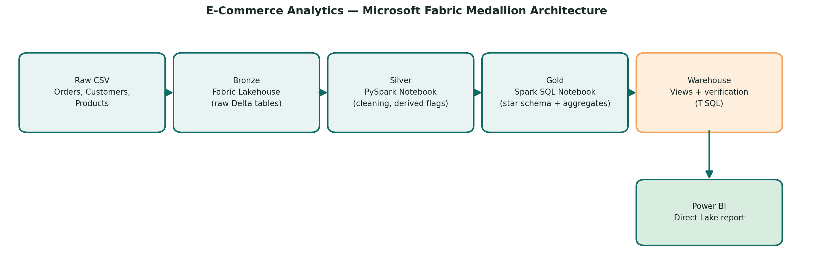
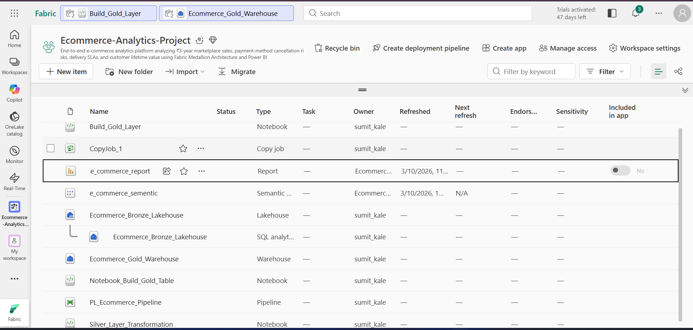
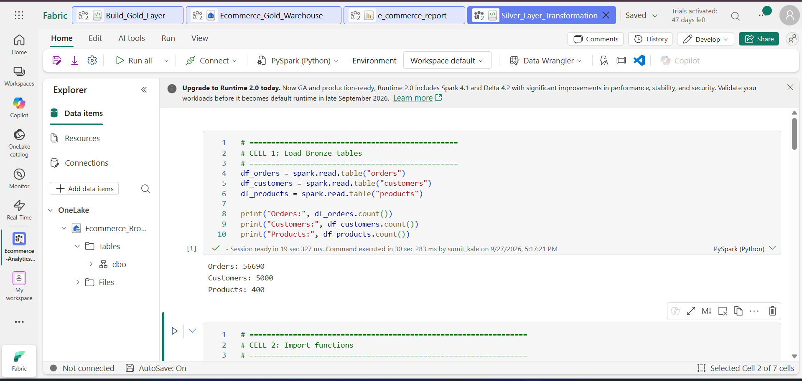
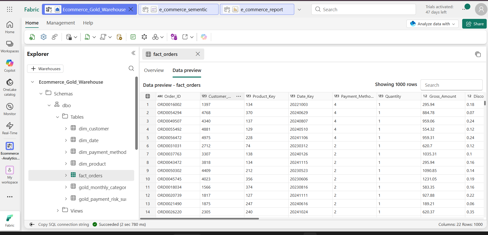
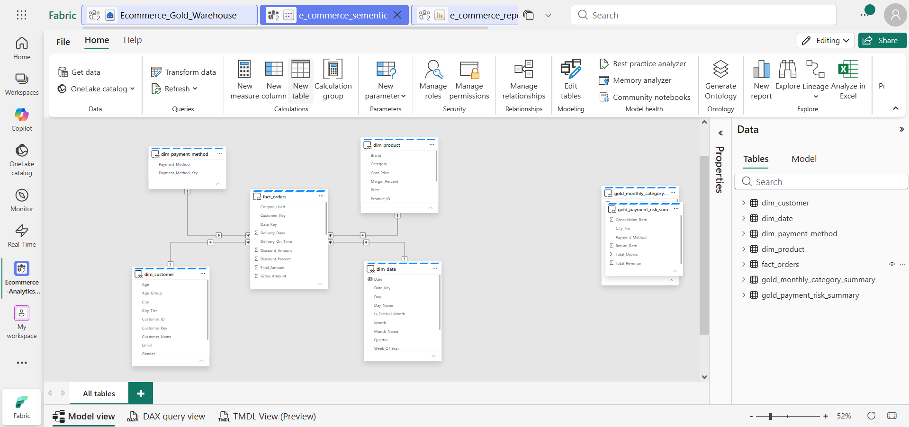
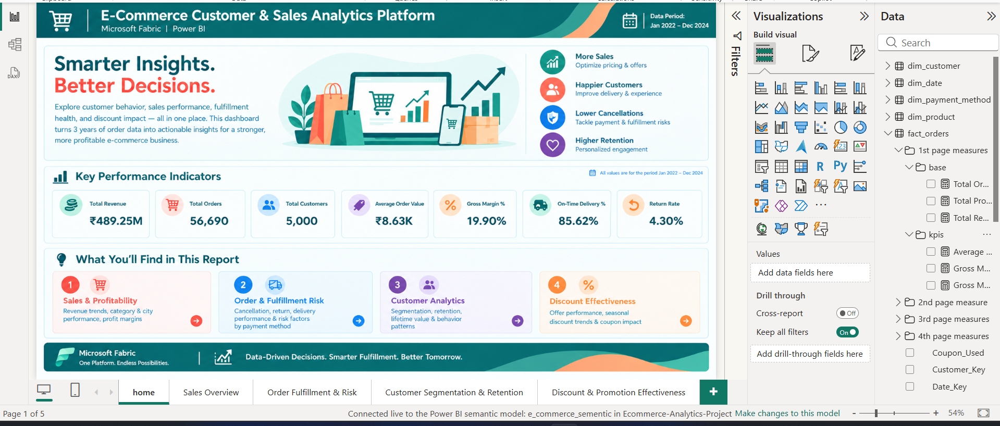
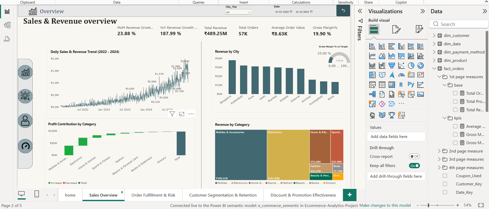
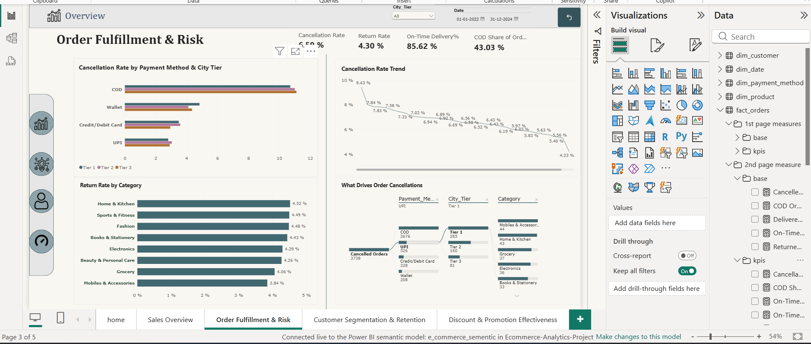
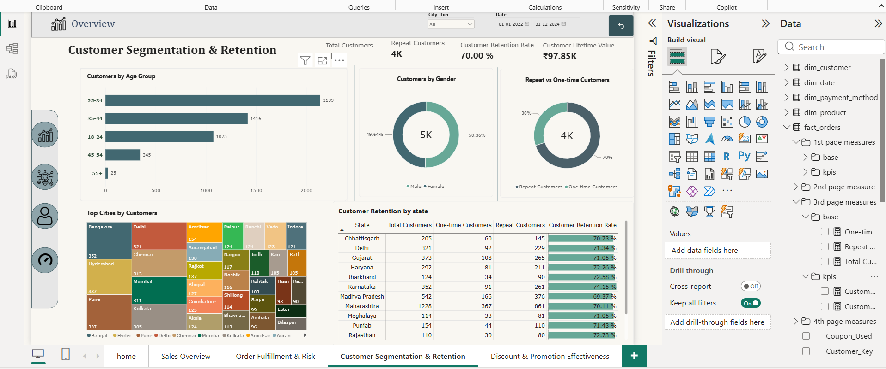
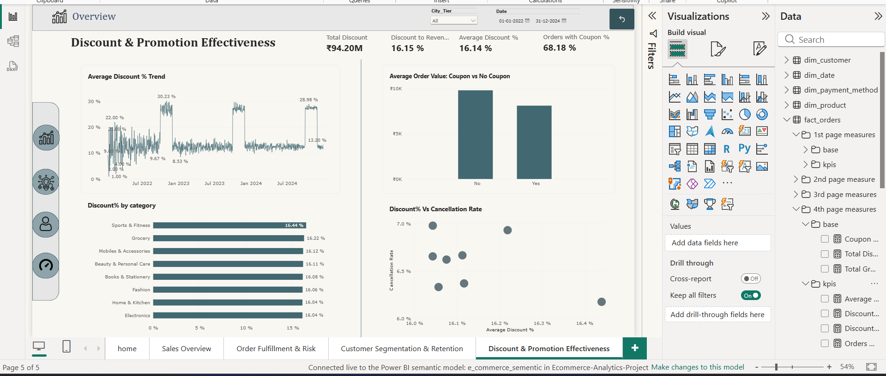

# E-Commerce Customer & Sales Analytics Platform — Microsoft Fabric

End-to-end data analytics solution built on Microsoft Fabric, covering the full medallion architecture (Bronze → Silver → Gold → Warehouse) and a Power BI report connected live via Direct Lake.



**Dataset note:** This project uses a synthetically generated dataset modeling realistic Indian e-commerce patterns — COD-driven cancellation risk, festival-season demand, Tier 1/2/3 city delivery behavior, and customer repeat-purchase patterns. It is not sourced from a live production system. The business logic embedded in the data (COD cancellation rates, tier-based delivery delays, festival discounting) was deliberately designed based on documented Indian e-commerce market patterns, so the analytics built on top remain representative of real-world conditions. The generation script is in [`Dataset/generate_dataset.py`](./Dataset/generate_dataset.py), and the full reasoning is documented in the [BRD](./Documentation/BRD_Ecommerce_Fabric_Project.md).

---

## Business Problem

The marketplace had no consolidated view of why orders were cancelled or returned, no delivery performance tracking by geography, no visibility into discount-vs-margin tradeoffs, and no customer segmentation — reporting relied on manual spreadsheet exports. This project builds a single, automated source of truth to answer 25 defined business questions (full list in the BRD).

**Key finding:** COD (Cash on Delivery) orders have a materially higher cancellation rate than digital payment methods (UPI, Card, Wallet) across every city tier — this is the core risk driver surfaced on the Order Fulfillment & Risk page.

---

## Architecture

| Layer | Where it happens | What it does |
|---|---|---|
| **Bronze** | Fabric Lakehouse | Raw `Orders`, `Customers`, `Products` CSVs loaded as Delta tables (no transformation — see `Dataset/`) |
| **Silver** | PySpark notebook | Date type casting, null handling, derived flags (`Is_Cancelled`, `Age_Group`, `Margin_Percent`), referential integrity checks — [`Silver layer/silver_layer_pyspark.py`](./Silver%20layer/silver_layer_pyspark.py) |
| **Gold** | Spark SQL notebook | Star schema (`Dim_Date`, `Dim_Customer`, `Dim_Product`, `Dim_Payment_Method`, `Fact_Orders`) + 2 aggregate tables (`Gold_Monthly_Category_Summary`, `Gold_Payment_Risk_Summary`) — [`Gold layer/build_gold_layer_sql_notebook.sql`](./Gold%20layer/build_gold_layer_sql_notebook.sql) |
| **Warehouse** | Fabric Warehouse (T-SQL) | Gold tables copied in via Data Pipeline; verification queries + a customer summary view — [`Gold layer/warehouse_queries_views`](./Gold%20layer/warehouse_queries_views) |
| **Reporting** | Power BI (Direct Lake) | 5-page report, 28+ DAX measures, time intelligence (MoM/YoY), decomposition tree, waterfall, scatter, gauge, treemap visuals |

**Tech stack:** Microsoft Fabric (Lakehouse, Warehouse, Notebooks, Data Pipelines), PySpark, Spark SQL, T-SQL, Power BI (Direct Lake), DAX.

---

## Dataset

- **Time period:** January 2022 – December 2024 (3 years)
- **Orders:** ~56,700 rows, 20 columns (payment method, discount, shipping, delivery SLA, return reason, rating)
- **Customers:** 5,000 rows, 9 columns (demographics, city tier, signup date)
- **Products:** 400 rows, 8 columns (category, brand, price, cost, margin, stock)

Full column-level documentation is in the [BRD](./Documentation/BRD_Ecommerce_Fabric_Project.md), Section 3.

---

## Report Pages

| Page | What it answers |
|---|---|
| **Home** | Executive summary — headline KPIs and navigation |
| **Sales & Revenue Overview** | Revenue trend, category/city performance, profit contribution, YoY/MoM growth |
| **Order Fulfillment & Risk** | Cancellation/return rate by payment method & city tier, root-cause decomposition |
| **Customer Segmentation & Retention** | Age/gender/city breakdown, repeat vs one-time customers, retention by state |
| **Discount & Promotion Effectiveness** | Discount trend, coupon impact on order value, discount-vs-cancellation correlation |

---

## Fabric Implementation

| | |
|---|---|
|  |  |
| Workspace overview | Silver layer notebook run |
|  |  |
| Warehouse tables | Semantic model relationships |

---

## Power BI Report

| | |
|---|---|
|  |  |
| Home | Sales & Revenue Overview |
|  |  |
| Order Fulfillment & Risk | Customer Segmentation & Retention |
|  | |
| Discount & Promotion Effectiveness | |

---

## Repository Structure

```
├── README.md
├── Dataset/
│   ├── Customers.csv
│   ├── Orders.csv
│   ├── Products.csv
│   └── generate_dataset.py          # synthetic dataset generator
├── Documentation/
│   ├── BRD_Ecommerce_Fabric_Project.md
│   └── Fabric_Architecture_Diagram.png
├── Silver layer/
│   └── silver_layer_pyspark.py      # Bronze -> Silver cleaning
├── Gold layer/
│   ├── build_gold_layer_sql_notebook.sql   # Silver -> Gold star schema (Spark SQL)
│   └── warehouse_queries_views             # Warehouse verification + view (T-SQL)
├── Screenshots/
│   ├── Fabric/                      # workspace, notebook, warehouse, semantic model
│   └── PowerBI/                     # all 5 report pages
└── powerbi/
    ├── pbip file/                   # Power BI Project (Direct Lake, zipped — see below)
    └── pbix file/                   # .pbix backup
```

---

## Key Insights

- COD orders cancel/return at a materially higher rate than digital payments across every city tier
- Revenue grew year-over-year through 2022–2024 as the customer base expanded
- Festival months (October–November) show a clear discount and sales spike, consistent with Diwali-season shopping patterns
- Customer retention rate sits around 70%, with Maharashtra contributing the highest state-level customer count
- Discount depth shows no strong correlation with cancellation rate — heavier discounting does not appear to drive more cancellations

---

## How to Explore

The `powerbi/pbip file/` folder is zipped (GitHub's web upload doesn't handle nested PBIP folders directly) — extract both `.zip` files into the same folder as the `.pbip` file before opening it in Power BI Desktop.

This report is connected live to a Microsoft Fabric Direct Lake semantic model, so opening it requires access to the author's Fabric workspace — it will not load data outside that environment, and Fabric trial capacities expire after a period of inactivity. If the `.pbip` doesn't load:
- Check `powerbi/pbix file/` for the `.pbix` backup (same report, may still open depending on connection state)
- Otherwise, refer to the **Screenshots** sections above for the full report

---

## Author

Sumit Kale — [LinkedIn] · [Portfolio/Resume link]
